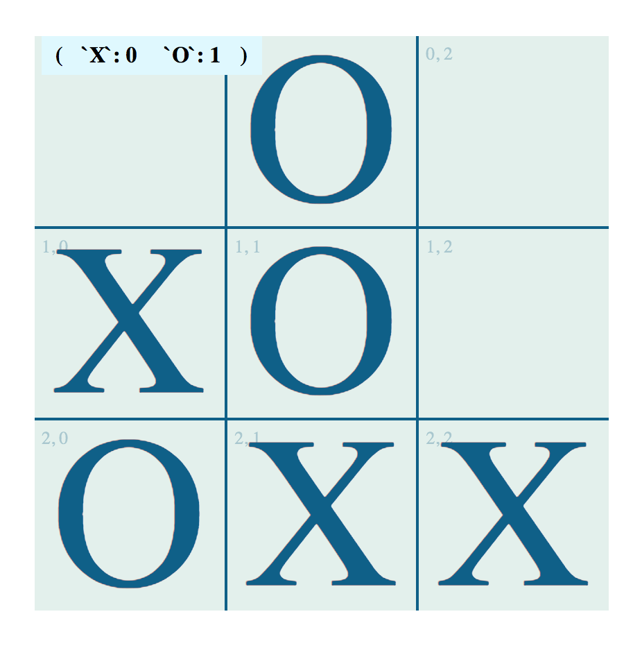

Tic Tac Toe Bot
===============

# Requirements 
- Docker
- Docker compose
- Any UNIX system. For windows bash scripts will not works but can be run manual

# Usage technologies 
- Docker 
- PHP 7.0.1
- Nginx 
- Symfony3 
- angularjs >1.6
- gulp

# Folder structure description 

````
- api        // represent server level {Symfony, PHP} bundle realization: `api/src/AppBundle`
- client     // represent client level {angularjs, html, css} ralization: `client/src`
- bin        // util bash scripts to easy works with docker
- screenshot // several screens of game 
````

For steps below confirm that im your system installed docker and docker-compose tools
https://docs.docker.com/engine/installation/

# Setup OS unix (Linux, Mac, FreeBSD) 
```
chmod +x bin/*
sh bin/start.sh

// open in brwoser http://localhost:8080/
// if that port busy you can change it in docker-compose.yml
```

# Windows
```
docker-compose -f docker-compose.yml up -d --no-deps
```

# API container setup unix way
```
bin/start.sh  
bin/get_in.sh api
cd /var/www/ 
bin/composer install -o 
```

# Unix test run 
````
bin/start.sh  
bin/get_in.sh api
cd /var/www/ 
vendor/phpunit/phpunit/phpunit --configuration /var/www/phpunit.xml.dist --teamcity
````

# Change/Create calculation logic for bot
1. Check that name present or add new here: `api/app/config/parameters.yml`. Section: `tactactoe.provider`
2. Determinate right provider creation at: `api/src/AppBundle/TicTacToe/Strategy/StrategyFactory.php`
3. Create new file for provider in: `api/src/AppBundle/TicTacToe/Strategy/Vendor`
4. Enjoy implementation of your logic or reuse mine. 

# Screenshot

